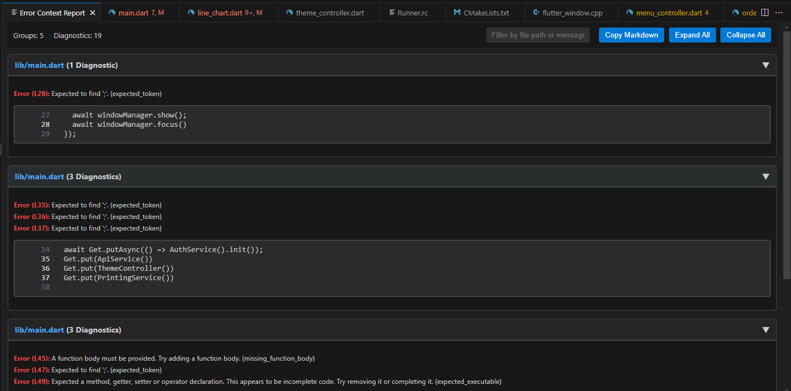
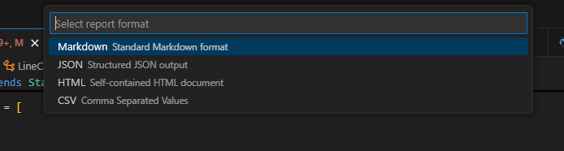

# Error Copier - VS Code Extension

[](https://code.visualstudio.com)

The **Error Context Copier** is a powerful VS Code extension designed to help developers quickly analyze, report, and share diagnostic information (errors, warnings, etc.) from their projects. It scans your codebase, intelligently groups related diagnostics, and provides multiple ways to view and export this information, complete with surrounding code context.


*(Image: Error Copier sidebar displaying Side Panel)*

*(Image: Error Copier displaying project diagnostics)*

*(Image: Error Copier displaying Folder Selection for Error Analysis)*

*(Image: Error Copier displaying many exporting options)*

## Key Features

*   **Comprehensive Diagnostics Scanning:**
    *   Scan selected subfolders, the entire workspace, the active file, or items selected in the Explorer.
    *   Leverages VS Code's built-in diagnostics API, respecting your project's linting and error-checking setup.
*   **Intelligent Grouping:**
    *   Consecutive or closely related diagnostics within the same file are grouped together for clearer reporting.
    *   Configurable line threshold for grouping.
*   **Rich Contextual Information:**
    *   For each diagnostic (or group), the report includes:
        *   File path.
        *   Severity (Error, Warning, Info, Hint).
        *   Line number(s).
        *   Error message(s) and code(s).
        *   Configurable number of lines of code before and after the diagnostic(s).
*   **Interactive Diagnostics Sidebar:**
    *   Dedicated sidebar view displaying a tree of all diagnostics in your workspace.
    *   **Live Updates (on save):** Automatically refreshes when you save a file.
    *   **Visual Grouping:** Diagnostics in the tree are grouped by file and then by proximity.
    *   **Filtering:** Filter the diagnostics tree by file path or message content.
    *   **Quick Actions:** Refresh, scan workspace, define scan scope, and export directly from the sidebar title bar.
    *   **Direct Navigation:** Click any diagnostic in the tree to jump to its location in your code.
    *   **Context Menus:** Perform actions like copying messages or scanning specific files/diagnostics.
*   **Interactive Webview Report Panel:**
    *   View detailed diagnostic reports in a rich, interactive VS Code panel.
    *   Syntax-highlighted code context.
    *   Clickable file paths and line numbers for easy navigation.
    *   Filterable report content.
    *   Expand/collapse diagnostic groups.
    *   Option to copy the full report as Markdown from the panel.
*   **Multiple Export Formats:**
    *   Copy reports to the clipboard in various formats:
        *   **Markdown:** Well-formatted for easy pasting into issues, documents, or messages.
        *   **JSON:** Structured data for programmatic use or integration with other tools.
        *   **HTML:** A self-contained HTML file for easy sharing and viewing in a browser.
        *   **CSV:** Comma-Separated Values for spreadsheet analysis.
*   **Highly Configurable:**
    *   Control the number of context lines (before/after).
    *   Specify which diagnostic severities to include (Error, Warning, Information, Hint).
    *   Ignore specific error codes or messages (supports strings and regex).
    *   Adjust the diagnostic grouping threshold.
    *   Respects global `files.exclude` settings.
*   **User-Friendly:**
    *   Progress notifications during scans.
    *   Clear informational messages.

## How to Use

### 1. Accessing the Diagnostics Sidebar

*   Click the **Error Copier icon** (typically `$(checklist)`) in the Activity Bar (far left).
*   The "Diagnostics" tree view will show diagnostics for your current workspace.
*   **Sidebar Actions:**
    *   **Filter (🔍/❌):** Click to enter filter text for the tree. Click again (or clear input) to remove the filter.
    *   **Refresh (🔄):** Manually refresh the diagnostics tree.
    *   **Define Scan Scope & Show Panel (📁):** Prompts to select subfolders, then scans and shows results in the interactive panel.
    *   **Scan Workspace & Show Panel (🖼️):** Scans the entire workspace and shows results in the interactive panel.
    *   **Scan Workspace & Export As... (📤):** Scans the entire workspace and prompts for export format (to clipboard).
*   **Tree Interactions:**
    *   **Click a diagnostic item:** Navigates to the code.
    *   **Right-click a file item:** Options to scan that file for panel or clipboard.
    *   **Right-click a diagnostic item:** Options to go to or copy the message.

### 2. Using Commands (Command Palette: `Ctrl+Shift+P` or `Cmd+Shift+P`)

*   **`Error Context: Scan Subfolders & Show Interactive Report`**
    1.  Prompts you to select one or more subfolders from your current workspace.
    2.  Scans these folders for diagnostics.
    3.  Opens the results in the Interactive Webview Report Panel.

*   **`Error Context: Scan Subfolders & Export Report As...`**
    1.  Prompts for subfolder selection.
    2.  Scans these folders.
    3.  Prompts you to choose an output format (Markdown, JSON, HTML, CSV).
    4.  Copies the report in the chosen format to your clipboard.

*   **`Error Context: Scan Subfolders & Copy Report (Markdown)`**
    *   Quickly scans selected subfolders and copies a Markdown report to the clipboard.

*   **`Error Context: Scan Entire Workspace & Copy Report (Markdown)`**
    *   Scans all files in all open workspace folders and copies a Markdown report.

*   **`Error Context: Scan Active File & Copy Report (Markdown)`**
    *   Scans only the currently active text editor and copies a Markdown report.

*   **`Error Context: Scan Selected Item(s) & Copy Report (Markdown)`**
    *   Available via right-click in the Explorer on files/folders.
    *   Scans the selected item(s) and copies a Markdown report.

## Installation

### From Marketplace (Recommended - When Published)

1.  Open VS Code.
2.  Go to the Extensions view (`Ctrl+Shift+X` or `Cmd+Shift+X`).
3.  Search for "Error Copier".
4.  Click "Install".

### From Source (For Development/Testing)

1.  Clone this repository:
    ```bash
    git clone https://github.com/AssabTigleG/error-copier.git
    cd error-copier
    ```
2.  Install dependencies:
    ```bash
    npm install
    ```
3.  Compile the TypeScript:
    ```bash
    npm run compile
    ```
    (Or use `npm run watch` for automatic recompilation during development).
4.  Open the `error-copier` folder in VS Code.
5.  Press `F5` to open a new Extension Development Host window with the extension loaded.
6.  In the Extension Development Host window, open a project with some errors to test the extension.

## Configuration

You can configure the Error Copier extension via VS Code's settings (`File > Preferences > Settings`, then search for "Error Context Copier").

*   **`errorcontextcopier.contextLinesBefore`** (default: `1`):
    *   Number of context lines to include before each diagnostic/group in reports.
*   **`errorcontextcopier.contextLinesAfter`** (default: `1`):
    *   Number of context lines to include after each diagnostic/group in reports.
*   **`errorcontextcopier.includeSeverities`** (default: `["Error"]`):
    *   Array of diagnostic severities to include (e.g., `["Error", "Warning"]`). Options: "Error", "Warning", "Information", "Hint".
*   **`errorcontextcopier.ignoredErrorCodes`** (default: `[]`):
    *   Array of error codes (as strings, e.g., `"ts2304"`, `"eslint(no-unused-vars)"`) to ignore during scans.
*   **`errorcontextcopier.ignoredErrorMessages`** (default: `[]`):
    *   Array of strings or regex patterns to ignore diagnostics if their message matches.
    *   For regex, enclose in slashes (e.g., `"/unused variable/i"`). Plain strings perform a case-sensitive substring match.
*   **`errorcontextcopier.groupingLineThreshold`** (default: `2`):
    *   Maximum number of lines between the end of one diagnostic and the start of the next for them to still be considered part of the same group. A value of `0` means they must overlap or be immediately adjacent.

The extension also respects your global `files.exclude` settings in VS Code to avoid scanning unwanted directories (like `node_modules`, `.git`, etc.) by default.

## Known Issues / Future Enhancements

*   Currently, all exported reports (JSON, HTML, CSV) are copied to the clipboard. An option to "Save As File..." would be a good addition.
*   More advanced filtering options for the sidebar tree (e.g., by error code).
*   Performance improvements for very large workspaces for the live sidebar updates.
*   *Your ideas here!*

## Contributing

Contributions are welcome! If you have an idea for a new feature, a bug fix, or an improvement, please:

1.  **Fork the repository.**
2.  **Create a new branch** for your feature or fix (`git checkout -b feature/your-feature-name` or `git checkout -b fix/your-bug-fix`).
3.  **Make your changes.**
4.  **Ensure code quality:**
    *   Run the linter: `npm run lint`
    *   Ensure TypeScript compiles: `npm run compile`
5.  **Test your changes thoroughly.**
6.  **Commit your changes** with a clear and descriptive commit message.
7.  **Push to your forked repository.**
8.  **Open a Pull Request** against the `main` branch of this repository.

Please provide a clear description of your changes in the Pull Request.

## License

This extension is licensed under the [MIT License](LICENSE.md).